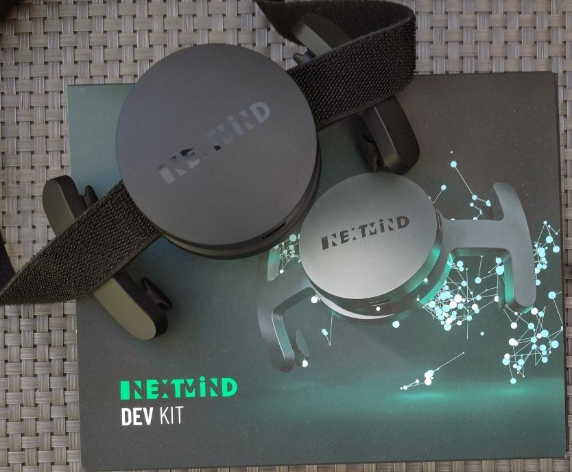

# 🇨🇵 2° Pourquoi NextMindCoin

<mark style="color:green;">**A) Next-Mind :**</mark>

&#x20;   La société Next-Mind fut fondée en 2017 par l'éminent professeur en neurosciences cognitives Sid KOUIDER , directeur de recherche au CNRS. Ses travaux ont abouti sur la création d’un casque éléctroencéphalogramme révolutionnaire permettant de capter et traduire notre cortex visuel.

Lors de sa présentation au CES 2020 de Las Vegas, sa startup française remporta deux prix : «  Best of Innovation et Honoree ».

\

&#x20;   Le potentiel de cette interface homme-machine est spectaculaire. Sa technologie permet de capter, par un léger casque EEG situé à l'arrière du crane, des images en temps réel depuis le cortex visuel. Imaginez vous en train de changer vos chaines de TV, tirer dans des jeux vidéos, piloter un drone, composer une musique qui vous vient à l'esprit ou bien valider une transaction, tout cela uniquement par la pensée.

Le champs d'utilisation reste infini car cette pépite technologique n'en est qu'à ses balbutiements, et grâce à l'équipe de NextMind ce casque a pu voir le jour et il est fourni avec un SDK outil de développement, qui vous permettra de prendre les commandes sur vos objets par la pensée.

Le casque peut étre couplé à des lunettes VR Oculus Quest 1/2&3, Oculus Rift, HoloLens 1&2, HTC Vive and Pro ou autres modéles.

\
<mark style="color:red;">**NextMindCoin n’a aucun lien avec la société Next-Mind qui conçoit et vend le casque, elle ne peut donc être en aucun cas, responsable du projet NextMindCoin car nous sommes 2 sociétés différentes.**</mark>

<mark style="color:red;">**Nous somme juste des clients et développeurs sur l’interface Next-Mind. Nous apprécions beaucoup le potentiel de cette technologie neuronale, facile à appréhender et nous espérons la faire connaître parmis différentes communautés (Gaming, Médecine, Robotique, Loisirs, ioT, DeepLearning...).**</mark>

<mark style="color:red;">****</mark>

<mark style="color:green;">**B) Dapps :**</mark>

&#x20;    Une **application décentralisée**, plus couramment appelée une **Dapp **(de l'anglais _Decentralized Application_), est une application logicielle dont le fonctionnement est (partiellement ou totalement) distribué et répliqué parmi un ensemble d'acteurs multiples. Elle se base généralement sur un ou plusieurs [**smart contracts**](https://cryptoast.fr/qu-est-ce-qu-un-smart-contract-contrat-intelligent/)** **s'exécutant sur une ou plusieurs [**blockchains**](https://cryptoast.fr/qu-est-ce-que-la-blockchain/).

Les applications décentralisées s'opposent aux applications centralisées.

L'usage monétaire du [**bitcoin**](https://cryptoast.fr/bitcoin/), qui peut être considéré comme une application décentralisée, contraste de cette manière avec la gestion de **l'euro** par le système bancaire et par la Banque Centrale Européenne.

Les applications de prêt décentralisées comme [**Maker**](https://cryptoast.fr/fiche-dai-makerdao/) ou [**Compound**](https://cryptoast.fr/compound-obtenez-interets-cryptomonnaies/) s'opposent aux **organismes de crédit**. Il existe des réseaux sociaux distribués dont la proposition de valeur est de résister à la censure comme [**Hive**](https://cryptoast.fr/dapp-splinterlands-migre-hive-steem/), [**Voice**](https://cryptoast.fr/reseau-social-voice-alimente-par-une-blockchain-sera-lance-4-juillet/) ou [**Memo.cash**](https://memo.cash), et qui diffèrent donc des plateformes comme **Facebook** ou **Twitter**.

#### <mark style="color:green;">Smart contracts et DApps</mark>

<mark style="color:red;">**     **</mark>La pierre angulaire d'une DApp c'est le ou les smart contracts sur lesquels elle se base. Ces contrats autonomes sont des programmes informatiques dont l'exécution ne dépend pas d'un tiers de confiance, et qui s'activent automatiquement lorsque certaines conditions sont remplies sur la blockchain sur lesquels ils sont hébergés. Le plus souvent, ils sont codés pour être hébergés sur une plateforme spécialisée comme Ethereum, BSC, Cardano, Solana ou Polygon. Néanmoins un contrat peut également être inscrit dans sa propre chaîne comme c'est le cas pour Hive ou pour les sidechains de Lisk.

&#x20;   L'avantage principal des contrats « intelligents » est de retirer l'intermédiaire qui valide les actions. De plus, puisque toutes les opérations réalisées au sein d'un contrat sont inscrites sur la blockchain, il sera possible de retrouver aisément l'historique des conditions dans lesquelles elles ont été effectuées.

&#x20;     Ensuite, un autre avantage non négligeable d'un smart contract est son coût : effectuer des opérations grâce à cette technologie est relativement bon marché, rapide et sûr. Cela permet donc d’effectuer d’énormes économies dans certains domaines professionnels, par rapport à une entreprise traditionnelle n'utilisant pas ces programmes.

Une fois déployées sur la chaîne, les clauses d'un contrat autonome ne peuvent pas être modifiées.

<mark style="color:green;">**C) Casque EEG BCI + Dapps = NextMindCoin :**</mark>

<mark style="color:green;">**      **</mark>Chez NextMindCoin nous avons l’objectif de concevoir des applications décentralisées utilisant comme hardware l’interface neuronal (le casque NEXT-MIND) et ainsi développer de nombreux champs d’utilisations :

Crypto-gaming, wallet sécurisé, médical, loisirs, robotique, artistique, éducatif...

Cette technologie n’en est qu’à ses tout débuts, et tout le travail sur les applications reste à faire. Imaginez tous le potentiel du casque, et inspirez-vous en, pour créer toutes sortes de Dapps.

Et c’est là que l’intêret de l' utility-token NXMC de NextMindCoin , apparait:

\-Staking pour les investisseurs de 15% annuel.

\-Play to Earn pour les gameurs et paris en mode multi-joueurs

\-Gouvernance pour la communauté

\-Minage passif pour permettre à chacun de recevoir des NXMC pour le nombre d'heures d'utilisation du casque.

Pour agrandir notre équipe et créer une communauté de développeurs autour de notre projet, il était primordial de mettre en place un système de récompense pour les développeurs.

&#x20;   Ainsi pour chaque contributeur, la communauté procédera à l’évaluation et à la rémunération, par un systéme de vote (gouvernance) lié au token NXMC. Tous les possesseurs de token NXMC pourront voter sur tous les projets présentés. Un bonus sera envisageable pour les meilleurs projets les plus utiles et pertinents.
