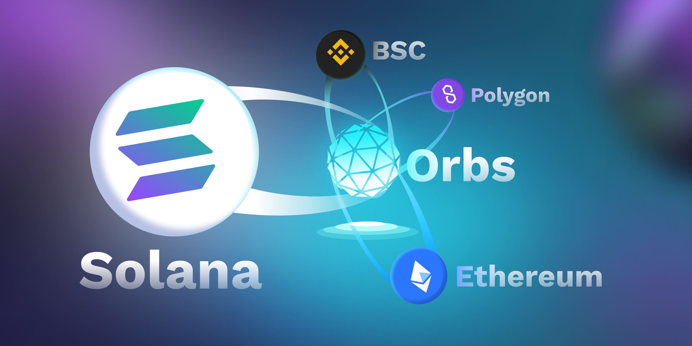

# 🇨🇵 3° Le Trilemme des Blockchains

<mark style="color:green;">**A) Sécurité, Décentralisation et scalabilité :**</mark>

<mark style="color:green;">**     **</mark>Selon [Vitalik Buterin](https://fr.wikipedia.org/wiki/Vitalik\_Buterin) fondateur de ETHEREUM, les [blockchains](https://stakepool.fr/definition/blockchain) rencontrent toutes un problème de taille : il serait techniquement impossible d'avoir un protocole racine qui soit à la fois **sécurisé**, **scalable** et **décentralisé dans l’ idéal**. Pour améliorer l'un de ces attributs, vous devez sacrifer l'un des deux autres. La blockchain parfaite devra résoudre ce trilemme, pour maximiser à la fois ces trois facteurs.

\
En effet depuis 2021, le réseau Ethereum est congestionné et ses frais de transactions en deviennent chers et aberrants. Son Layer 2, Polygon MATIC reste une bonne alternative pour diminuer la surcharge du réseau et les frais, mais POLYGON reste notre second choix derrière Solana.

<mark style="color:green;">**B) Solana et Matic Polygon :**</mark>

<mark style="color:green;">**      **</mark>Nos recherches se sont beaucoup tournées vers SOLANA qui est la Blockchain la plus rapide et qui assure un flux minimum de 50K Tps (50 000 transactions/seconde), équivalent à celui de VISA. En plus d’avoir des frais minimes de 0,0001 cts par transaction, une communauté grandissante, ses caractéristiques, son consensus PoH (Proof-of-History) ainsi que son langage de programation en RUST nous ont intrigués.

Solana était donc la réponse à d’éventuels problèmes de scalabilité et de frais exhorbitants. Le langage de programmation RUST est performant et sécurisé. Idéal pour les Dapps.

Polygon étant le layer 2 d'Ethereum, reste une bonne alternative pour déployer nos Dapps.

Orbs est un bridge pour interagir entre plusieurs blockchains.&#x20;

