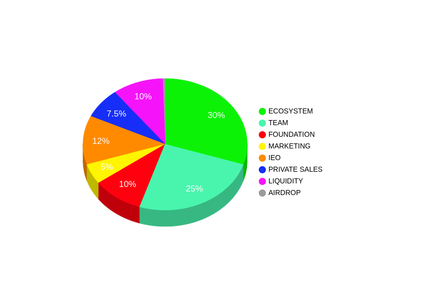

# 🇨🇵 5° IEO (Initial Exchange Offering)

<mark style="color:green;">**A) Présentation de l’ IEO :**</mark>

<mark style="color:green;">**      **</mark>Aussi appelé _**« token sales »**_, l’IEO consiste en **l’émission d’actifs numériques**, les « tokens » (jetons, en français) **échangeables contre des cryptomonnaies **lors de la phase de démarrage de l’activité de la startup.&#x20;

Concrètement, la startup émet des tokens et ils peuvent être acquis par toute personne en échange de cryptomonnaie. Pour assurer la sécurité des investisseurs et la réglementation KYC, cette offre se fait sur un Exchange réglementé.

Le transfert de cet actif numérique s’effectue donc entre deux personnes sur Internet, **sans nécessiter l’accord d’un tiers**, c’est-à-dire sans établissement bancaire. Il s’agit donc d’un moyen **décentralisé et dématérialisé pour lever des capitaux**.

****

<mark style="color:green;">**B) Tokenomics et Vesting schedule **</mark>**:**

Nombre d’unité : 1 Milliard ( 1 000 000 000 )

Nom du token: NXMC

Native-SPL : Token-utility

Le token NXMC est déployé sur la SOLANA Blockchain, un bridge sera mis en place sur Polygon.

Adresse du Contrat  du token :\
4qv2AGjhzxiNz5iTUnTdRVYjjacmaEcVGgFcr1R6sRFe

[https://explorer.solana.com/address/4qv2AGjhzxiNz5iTUnTdRVYjjacmaEcVGgFcr1R6sRFe](https://explorer.solana.com/address/4qv2AGjhzxiNz5iTUnTdRVYjjacmaEcVGgFcr1R6sRFe)                    [https://solscan.io/token/4qv2AGjhzxiNz5iTUnTdRVYjjacmaEcVGgFcr1R6sRFe](https://solscan.io/token/4qv2AGjhzxiNz5iTUnTdRVYjjacmaEcVGgFcr1R6sRFe)

Blocage des tokens par programme (smart-contract) sur Bonfida par Audit certifié.

**Approvisionnement MAX: 1 000 000 000 de NXMC (Possibilité de  brûler)**

<mark style="color:green;">**30 % ECOSYSTEM REWARDS: Déblocage mensuel sur 3 ans**</mark>

**25 % TEAM: Déblocage mensuel sur 2 ans**

<mark style="color:red;">**10 % FOUNDATION: Déblocage mensuel sur 3 ans**</mark>

<mark style="color:yellow;">**5% MARKETING: Déblocage mensuel sur 1 an**</mark>

<mark style="color:orange;">**12 % IEO: Déblocage total le 25 Décembre 2021**</mark>

<mark style="color:blue;">**7.5 % PRIVATE SALES: Déblocage total le 25 Décembre 2021**</mark>

**0.5% AIRDROP: Déblocage total de 25 Décembre 2021**

<mark style="color:purple;">**10% LIQUIDITY: Déblocage mensuel sur 1 an**</mark>

****

****

<mark style="color:green;">**C) Modalité et dates de l'IEO:**</mark>

Les ventes privées de NXMC se déroulerons du 12 novembre au 26 Novembre 2021,  directement sur notre site sur [cette page.](https://nextmindcoin.com/fr/VENTES-PRIVEES/)&#x20;

Prix du token NXMC: 0,002 usd

L' IEO se déroulera sur [YFDAI.finance](https://dashboard.yfdai.finance) tout début Décembre 2021.

Prix du token NXMC: 0,0035 usd
