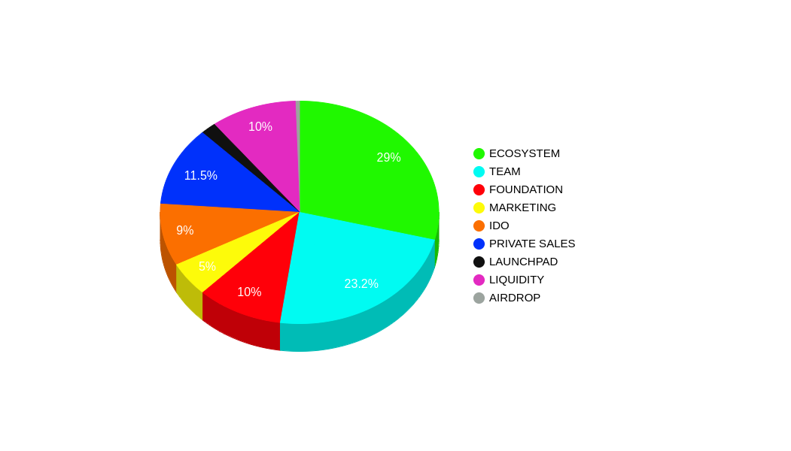

# 🇨🇵 5° Launchpad

<mark style="color:green;">**A) Présentation du launchpad :**</mark>

Un launchpad permet de faire une levée de fond sur un échange décentralisé. Il peut se diviser en plusierus étapes comme la private sale et l' IDO

<mark style="color:green;">**B) Tokenomics et Vesting schedule**</mark>** :**

Nombre d’unité : 1 Milliard ( 1 000 000 000 )

Nom du token: NXMC

Native-SPL : Token-utility

Le token NXMC est déployé sur la SOLANA Blockchain, un bridge sera mis en place sur Polygon.

Adresse du Contrat  du token :\
4qv2AGjhzxiNz5iTUnTdRVYjjacmaEcVGgFcr1R6sRFe

[https://explorer.solana.com/address/4qv2AGjhzxiNz5iTUnTdRVYjjacmaEcVGgFcr1R6sRFe](https://explorer.solana.com/address/4qv2AGjhzxiNz5iTUnTdRVYjjacmaEcVGgFcr1R6sRFe)                    [https://solscan.io/token/4qv2AGjhzxiNz5iTUnTdRVYjjacmaEcVGgFcr1R6sRFe](https://solscan.io/token/4qv2AGjhzxiNz5iTUnTdRVYjjacmaEcVGgFcr1R6sRFe)

Blocage des tokens par programme (smart-contract) sur Bonfida par Audit certifié.

**Approvisionnement MAX: 1 000 000 000 de NXMC (Possibilité de  brûler)**

<mark style="color:green;">**29 % ECOSYSTEM REWARDS: Déblocage mensuel sur 3 ans**</mark>

**23.2 % TEAM: Déblocage mensuel sur 2 ans**

<mark style="color:red;">**10 % FOUNDATION: Déblocage mensuel sur 3 ans**</mark>

<mark style="color:yellow;">**5% MARKETING: Déblocage mensuel sur 1 an**</mark>

<mark style="color:orange;">**9 % IDO: 50% TGE puis 10% linéaire sur 5 mois .**</mark>

<mark style="color:blue;">**11.5 % PRIVATE SALES: 20% TGE linéaire sur 5 mois.**</mark>

**0.5% AIRDROP: Déblocage total au listing.**

<mark style="color:purple;">**10% LIQUIDITY: Déblocage mensuel sur 1 an**</mark>

****

****

<mark style="color:green;">**C) Modalité et date du listing:**</mark>

Les ventes de NXMC se déroulerons début Décembre sur YFDAI.finance

Prix du token à la pré-sale : 0,0025 usd

Prix du token à l' IDO: 0,008 usd

Prix du token au listing: 0,01 usd

